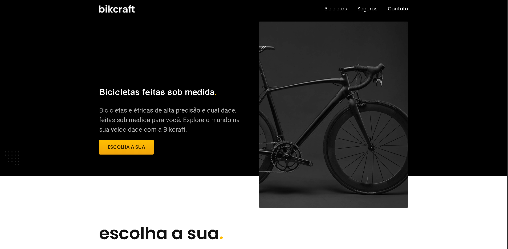

# Bikcraft

Projeto desenvolvido durante meus estudos de Front-end com foco em HTML, CSS e JavaScript.

O objetivo do projeto foi praticar a criação de interfaces modernas, responsivas e acessíveis, aplicando conceitos reais de desenvolvimento web.

## 🚀 Tecnologias utilizadas

- HTML5
- CSS3
- JavaScript
- Git
- GitHub

## 🎯 Funcionalidades

- Layout responsivo
- Estrutura semântica
- Navegação interativa
- Perguntas frequentes com JavaScript
- Animações e interações
- Organização modular de CSS

## 📚 Aprendizados

Durante o desenvolvimento deste projeto pratiquei:

- Responsividade
- Flexbox e Grid Layout
- Manipulação do DOM
- Organização de arquivos CSS
- Boas práticas de HTML semântico
- Versionamento com Git e GitHub

## 🔗 Deploy

[Acessar projeto](https://destefanir.github.io/bikcraft/)

## 📸 Preview

## 👨‍💻 Autor

Desenvolvido por Rafael Destefani.
